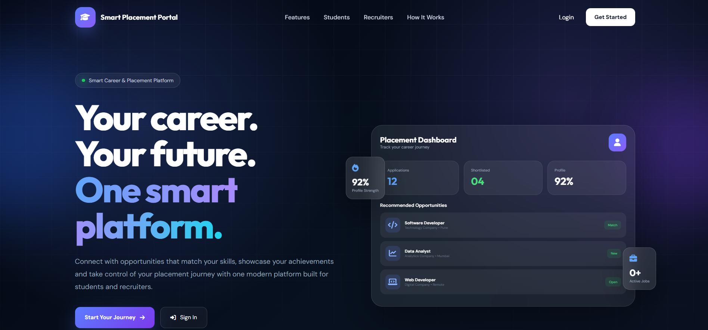
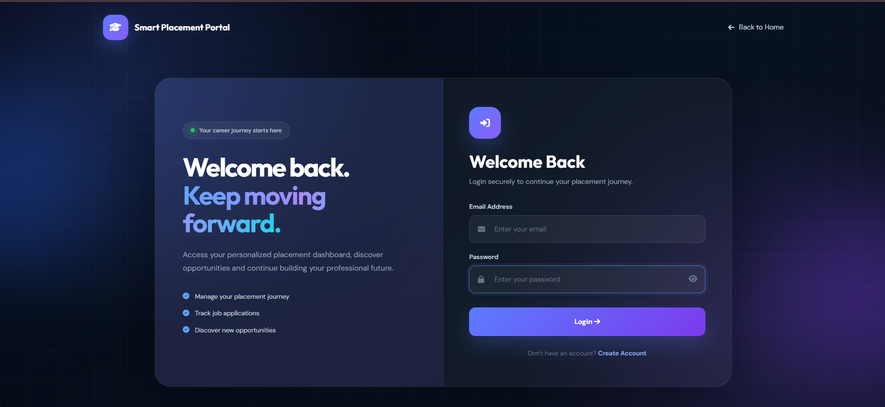
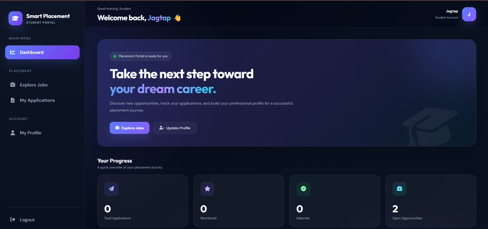
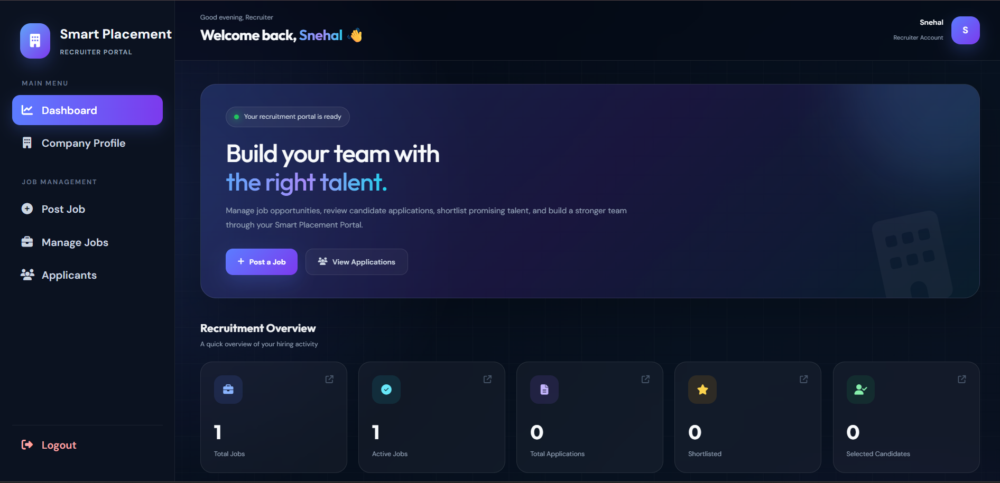
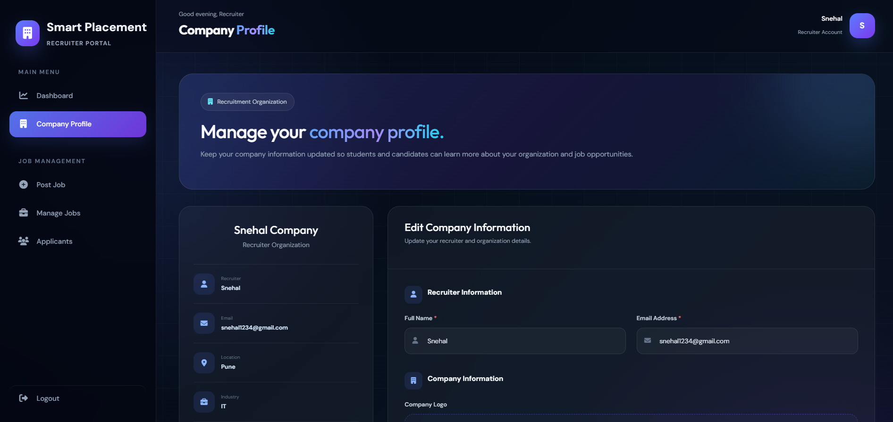

# 🎓 Smart Placement Portal

A full-stack web-based **Smart Placement Portal** designed to simplify the placement process by connecting **students and recruiters** through a centralized platform.

Students can manage their profiles, explore job opportunities, apply for jobs, and track their application status. Recruiters can manage their company profiles, post job opportunities, manage jobs, and view applicants.

---

## 🚀 Features

### 👨‍🎓 Student Portal

- Secure student registration and login
- Role-based authentication
- Student dashboard
- Profile management
- Resume management
- Browse available job opportunities
- View job details
- Apply for jobs
- Track application status
- View shortlisted and selected applications
- Recent application activity

### 🏢 Recruiter Portal

- Recruiter registration and login
- Role-based authentication
- Recruiter dashboard
- Company profile management
- Post new job opportunities
- Manage posted jobs
- Edit job details
- View job applicants
- Manage candidate applications

---

## 📊 Dashboard

### 👨‍🎓 Student Dashboard

The student dashboard provides an overview of:

- Total applications
- Shortlisted applications
- Selected applications
- Available job opportunities
- Latest job opportunities
- Student profile summary
- Recent application activity

### 🏢 Recruiter Dashboard

The recruiter dashboard allows recruiters to:

- Manage their company profile
- Post new job opportunities
- Manage posted jobs
- View applicants
- Manage placement activities

---

## 🔐 Authentication & Security

The project includes:

- Role-based access control
- Student authentication
- Recruiter authentication
- Secure session management
- Protected dashboard pages
- Logout functionality
- Separate student and recruiter access

---

## 🛠️ Technologies Used

### Frontend

- HTML5
- CSS3
- JavaScript
- Font Awesome
- Google Fonts

### Backend

- PHP

### Database

- MySQL

### Development Environment

- XAMPP
- Apache

---

## 📁 Project Structure

```text
SmartPlacementPortal/
│
├── config/
│   └── database.php
│
├── includes/
│   ├── auth.php
│   ├── student_sidebar.php
│   └── recruiter_sidebar.php
│
├── student/
│   ├── dashboard.php
│   ├── jobs.php
│   ├── job_details.php
│   ├── applications.php
│   └── profile.php
│
├── recruiter/
│   ├── dashboard.php
│   ├── company_profile.php
│   ├── post_job.php
│   ├── manage_jobs.php
│   └── applicants.php
│
├── screenshots/
│   ├── landing-page.png
│   ├── login-page.png
│   ├── student-dashboard.png
│   ├── recruiter-dashboard.png
│   └── job-management.png
│
├── uploads/
│
├── index.php
├── login.php
├── register.php
├── logout.php
│
├── .gitignore
└── README.md
```

---

# 📸 Screenshots

## 🏠 Landing Page



## 🔐 Login Page



## 👨‍🎓 Student Dashboard



## 🏢 Recruiter Dashboard



## 💼 Job Management



---

# ⚙️ Installation and Setup

## 1. Clone the Repository

```bash
git clone https://github.com/YOUR-USERNAME/Smart-Placement-Portal.git
```

## 2. Move the Project to XAMPP

Move the project folder into:

```text
C:\xampp\htdocs\
```

For example:

```text
C:\xampp\htdocs\SmartPlacementPortal
```

## 3. Start XAMPP

Open the XAMPP Control Panel and start:

- Apache
- MySQL

## 4. Create the Database

Open phpMyAdmin:

```text
http://localhost/phpmyadmin
```

Create the required MySQL database.

Import the project's SQL file if it is included in the repository.

## 5. Configure the Database Connection

Update the database configuration file:

```text
config/database.php
```

Example:

```php
$host = "localhost";
$username = "root";
$password = "";
$database = "your_database_name";
```

## 6. Run the Project

Open your browser and visit:

```text
http://localhost/SmartPlacementPortal/
```

---

# 👥 User Roles

## 👨‍🎓 Student

Students can:

- Create and manage their profile
- Upload and manage resumes
- Explore available job opportunities
- View job details
- Apply for jobs
- Track application status

## 🏢 Recruiter

Recruiters can:

- Manage company information
- Post job opportunities
- Manage posted jobs
- View applicants
- Manage candidate applications

---

# 🎨 UI Design

The project features a modern and responsive interface with:

- Dark professional dashboard theme
- Glassmorphism UI elements
- Gradient components
- Responsive layout
- Interactive sidebar navigation
- Mobile-friendly design
- Separate student and recruiter dashboards

---

# 🔮 Future Improvements

- 👨‍💼 Admin dashboard
- 📧 Email notifications
- 📅 Interview scheduling
- 🤖 AI-based resume analysis
- 🎯 AI-based job recommendations
- 🧠 Student skill matching
- 📊 Advanced placement analytics
- 🔍 Advanced job search and filters
- 🔔 Real-time notifications
- 🔑 Password reset functionality

---

# 🎯 Project Objective

The objective of the Smart Placement Portal is to digitize and simplify the placement process by providing a centralized platform where:

- Students can discover career opportunities.
- Recruiters can find suitable candidates.
- Job applications can be managed efficiently.
- Placement activities can be tracked easily.

---

# 👩‍💻 Developer

**Snehal Jagtap**

Computer Engineering Student | Aspiring Software Developer

---

## ⭐ Support

If you find this project useful, consider giving the repository a ⭐.

---

<p align="center">

<b>Connecting Students with Career Opportunities 🚀</b>

</p>